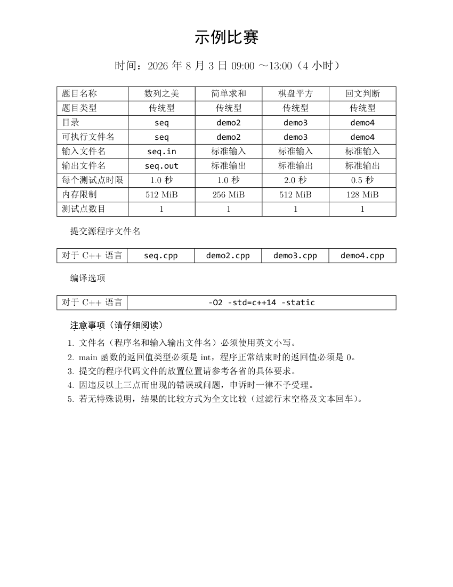
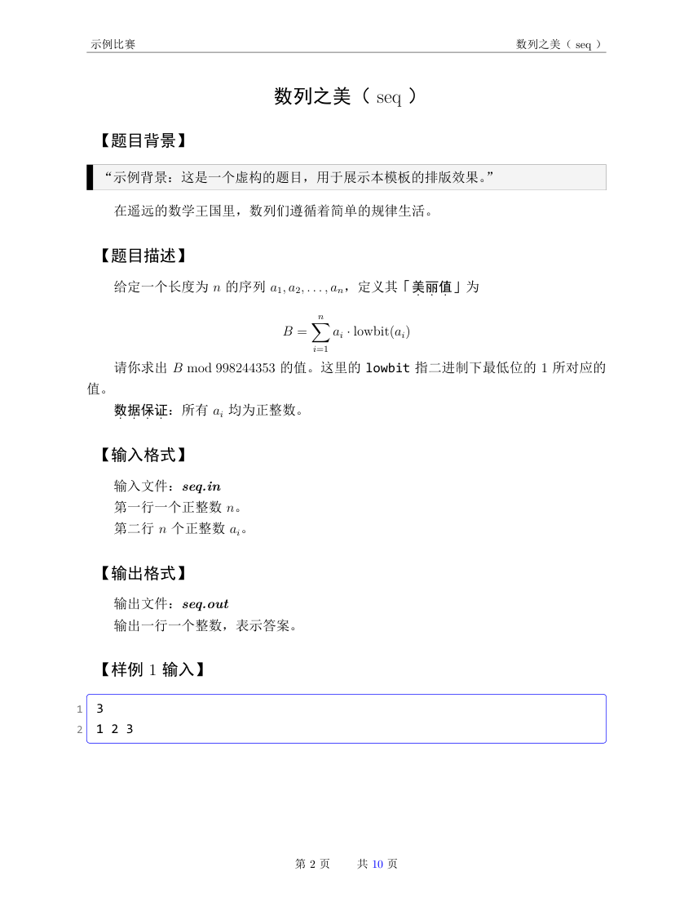
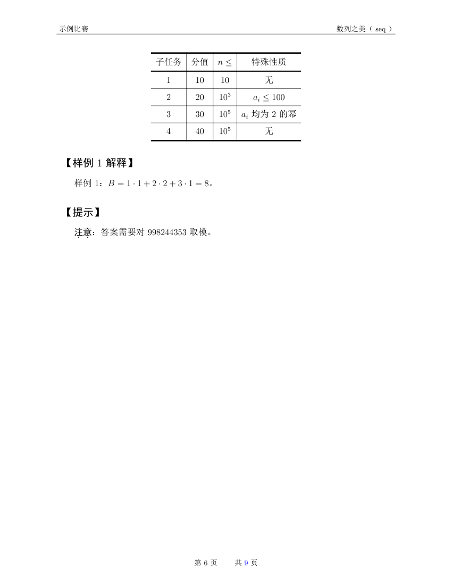

# 洛谷组赛：NOIP 风格题面生成工具

用洛谷题目组比赛：选好题目（洛谷题号）后，一键生成 **NOIP 官方风格**的题面 PDF 与样例数据文件，打包下发即用。

**输入**：一份比赛配置（`contest.json`，或命令行参数）——比赛名称、日期、注意事项，以及题目列表（每题一个洛谷题号，可配英文名 / 题目类型 / 文件 IO）。

**输出**：`output/<比赛名>/` 下——每题一个 PDF + 合集 PDF（NOIP 版式：封面信息表、【】节标题、样例框、数据范围表、页眉页码）、样例数据目录、可独立编译的 LaTeX/HTML 源码、一键下发 zip。

支持双后端：

- **LaTeX 后端**（默认）：xelatex + minted 排版，格式参考 [OI-statement-LaTeX](https://github.com/Wallbreaker5th/OI-statement-LaTeX)（WC2021/NOI2021 风格）
- **HTML 后端**：Chromium 打印，无需 LaTeX

## 效果预览







完整 PDF：[example/example.pdf](example/example.pdf)（虚构题面，仅演示版式）。 `example/` 中的 PDF 与截图由脚本一键生成：

```bash
python3 example/build_example.py    # 读 example.json → 生成 tex → 编译 PDF → 渲染截图
```

不想装 Python 环境的话，也可以直接用 [example/example.tex](example/example.tex) 编译（自包含单文件，封面与题面全部内联；`statement.cls` 为指向 `assets/latex/` 的符号链接）：

```bash
cd example && xelatex -shell-escape example.tex   # 连续编译两遍（minted 需要）
```

- [example/example.json](example/example.json)：示例配置（虚构题面内容）
- [example/build_example.py](example/build_example.py)：一键生成脚本（示例配置 → tex → PDF → 截图）

## 安装（首次）

```bash
python3 -m venv .venv
.venv/bin/pip install -r requirements.txt
.venv/bin/playwright install chromium
.venv/bin/python download_assets.py   # 下载 KaTeX 字体与思源宋体到 assets/
```

LaTeX 后端需要：

- `xelatex`（MiKTeX 或 TeX Live，含 ctex 宏包）
- **官方同款字体**（与 NOIP 官方 PDF 一致，`ctex` 使用 `fontset=windows`）： SimSun（宋体）、SimHei（黑体）、KaiTi、FangSong、Microsoft YaHei、Consolas。从 Windows 的 `C:\Windows\Fonts\` 拷贝，或从字体收集仓库下载后放入 `~/.local/share/fonts/`，然后 `fc-cache -f` + `initexmf --update-fndb`，用 `fc-list | grep -i simsun` 验证。
- pygments 已随 requirements 安装（`.venv/bin/pygmentize` 自动加入 PATH）

## 组一场新模拟赛

（可选）若题目带附件（如参考代码、数据包），下载需要登录态——复制
`.luogu_cookies.example.json` 为 `.luogu_cookies.json`，填入浏览器中洛谷的
`__client_id` 与 `_uid` cookie（仅用于附件下载，不入库；题面与样例抓取不需要登录）：

```bash
cp .luogu_cookies.example.json .luogu_cookies.json   # 填入 cookie 值
```

复制 `contest.example.json` 为 `contest.json`，然后编辑：

```json
{
  "contest": "示例比赛",
  "date": "2026-08-03",
  "time": "9:00-13:00",
  "duration": "4 小时",
  "problems": [
    { "pid": "P1000", "english": "demo1" },
    { "pid": "P1001", "english": "demo2" },
    { "pid": "P1002", "english": "demo3" },
    { "pid": "P1003", "english": "demo4" }
  ],
  "notes": ["自定义注意事项（可省略，有默认值）"]
}
```

字段说明：

| 字段 | 说明 |
|------|------|
| `contest` | 比赛名称，显示在封面、页眉和输出目录名 |
| `date` | 比赛日期，封面显示为「2026 年 8 月 3 日」 |
| `time` / `duration` | 比赛时间，封面显示为「09:00 ～ 13:00（4 小时）」 |
| `problems[].pid` | 洛谷题号（仅内部抓取用，不会出现在题面/文件名中） |
| `problems[].english` | 可选，英文名（显示为「题名（english）」，封面可执行文件名）；不填则标题只显示中文名、可执行文件名用 `t1`/`t2` |
| `problems[].type` | 可选，题目类型，默认「传统型」 |
| `problems[].io` | 可选，`"file"` 表示文件 IO（输入/输出走 `{english}.in` / `{english}.out`，封面与题面相应显示文件名）；默认标准 IO。文件 IO 必须配置 `english` |
| `notes` | 可选，封面注意事项列表，不填用 NOIP 风格默认值 |

运行：

```bash
.venv/bin/python main.py                    # LaTeX 后端（默认）
.venv/bin/python main.py --backend html    # HTML 后端
```

也可全部用命令行（不用配置文件）：

```bash
.venv/bin/python main.py --backend latex \
  --contest "示例比赛" --date 2026-08-03 \
  --time 9:00-13:00 --duration "4 小时" \
  --problems P1000,P1001,P1002,P1003
```

## 输出

```text
output/示例比赛/
├── 第1题-demo1.pdf              # 每题一个 PDF
├── 第2题-demo2.pdf
├── 第3题-demo3.pdf
├── 第4题-demo4.pdf
├── 示例比赛-题面合集.pdf         # 封面 + 全部题目
├── data/                        # 样例数据与附件，每个可执行文件名一个目录
│   └── t1/                      # 样例 {n}.in/.ans；有 english 时 {english}{n}.in/.ans
│       ├── 1.in
│       ├── 1.ans
│       ├── 2.in
│       └── 2.out
├── html/                        # HTML 后端中间文件（含 fonts/，目录自包含）
├── package.sh                   # 一键重新编译 + 打包下发 zip
└── tex/                         # LaTeX 源码（--backend latex 时生成）
    ├── build.sh                 # 一键重新编译全部
    ├── 第1题-demo1.tex          # 单题文档（\input 引用题面 body）
    ├── 示例比赛-题面合集.tex     # 合集文档（封面 + \input 各题面）
    ├── statement.cls            # 模板（改样式）
    ├── img/                     # 题面图片
    └── 题面/                    # 题面内容（单题与合集共用）
```

另外，运行还会在项目根目录生成 `.work/`（抓取缓存与中间产物）以及 `tex/` 内的编译中间文件（`*.aux`、`*.log` 等）——均为中间产物，可随时删除，重新运行即再生成。

## 自定义排版（高级）

输出目录的 `tex/` 下保存了全部 LaTeX 源码，可手动修改后重新编译（单题与合集共用 `题面/` 下的内容，改一处两处同步生效）：

```bash
cd output/<比赛名>/tex
./build.sh
```

- `statement.cls`：全局样式（字体、页眉页脚、样例框）
- 超宽表格（列多超出版心）处理：把表格外层 `\begin{center}\begin{tblr}{` 改为 `\begin{center}\makebox[\textwidth][c]{%`（左右对称溢出页边距，方法已注释在 `templates/tblr.tex.j2` 头部）

## 打包下发

`main.py` 运行完会自动预打包 `<比赛名>-下发.zip`（题面 PDF + `data/` 样例数据）。修改 `tex/` 源码后，用输出目录下的 `package.sh` 重新编译并打包：

```bash
cd output/<比赛名>/
./package.sh
```

`package.sh` 内部调用 `tex/build.sh`（并行编译，xelatex 日志静默，只显示进度与失败摘要）。

## 其他选项

| 参数 | 作用 |
|------|------|
| `--backend {html,latex}` | 渲染后端（默认 latex） |
| `--output-dir DIR` | 改输出目录（默认 `output/`） |
| `--no-merge` | 不生成合集 PDF（HTML 中间文件始终在 `<比赛名>/html/`，LaTeX 源码在 `tex/`） |
| `--config FILE` | 指定其他配置文件 |


## 实现说明

工作原理、双后端一致性约定、模块结构与定制入口见 [docs/implementation.md](docs/implementation.md)（面向开发与二次定制）。

## 免责声明

- 本项目仅供**个人学习与自用**，请勿用于商业用途或批量抓取。
- 题面内容版权归洛谷及原出题人所有；根据 [洛谷用户协议](https://help.luogu.com.cn/ula/luogu) 第 4.1 条，题面资料「仅可作为私人和非商业用途使用」——本工具仅将公开页面按原样转换格式、低频访问、不规避任何访问限制，生成物请勿再发行或传播。
- 「NOIP 官方格式」仅为版式上的参考与模仿，与 CCF / NOI 官方无任何关联，生成物不代表官方发布。
- LaTeX 模板版式思路参考 [OI-statement-LaTeX](https://github.com/Wallbreaker5th/OI-statement-LaTeX) （该仓库未声明许可证，本项目仅参考版式、未复制其代码）。
- 生成的题面 PDF 请勿向无关人员传播。

